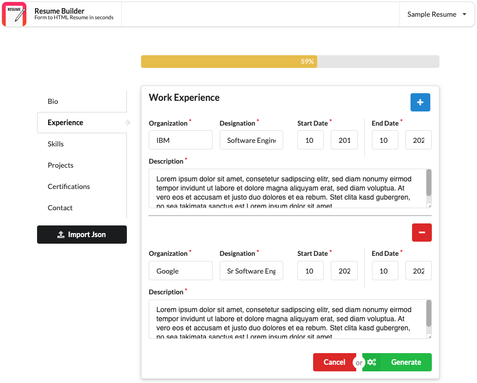
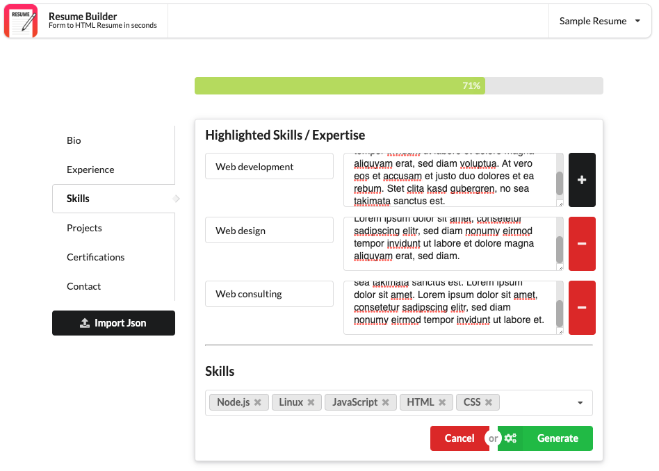
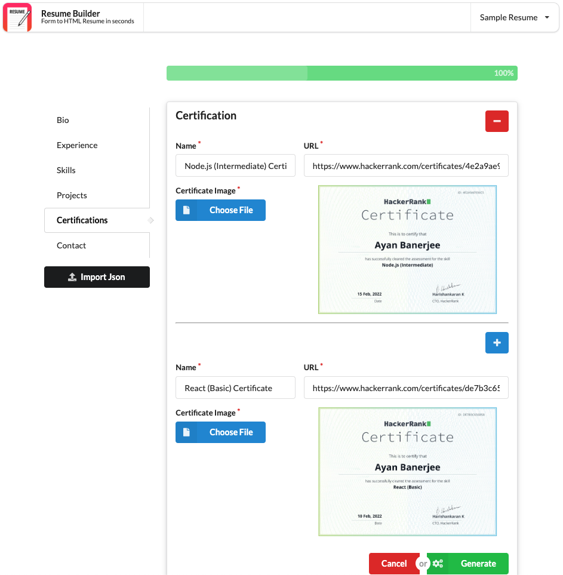
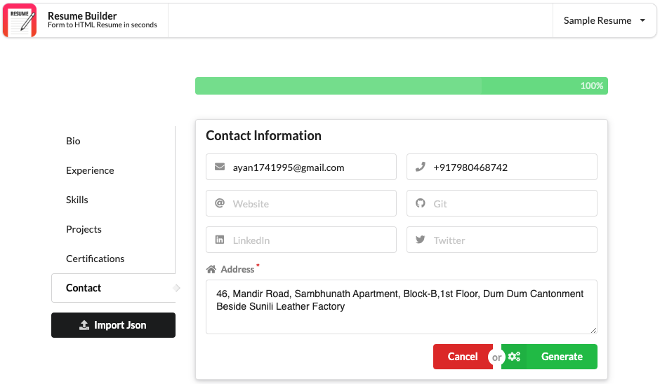
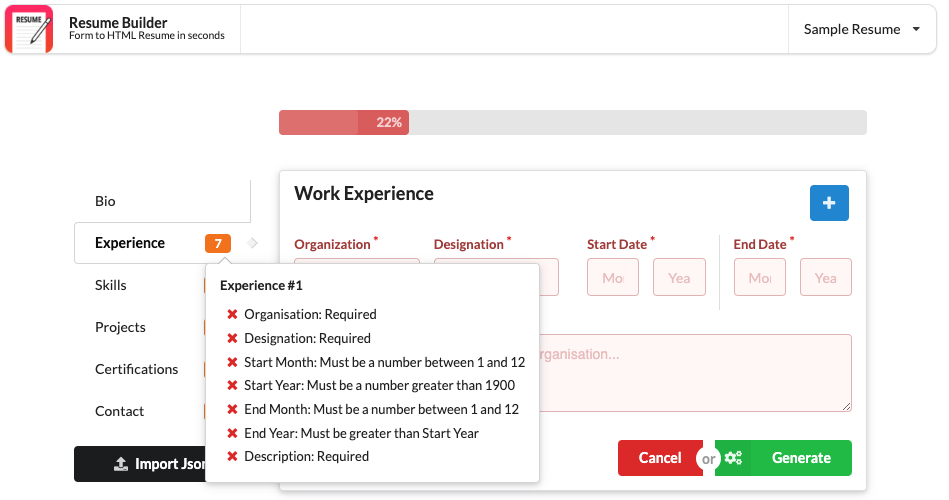
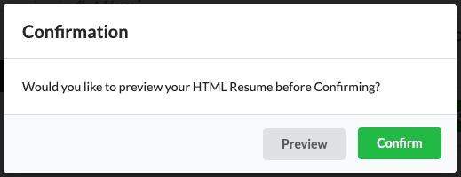
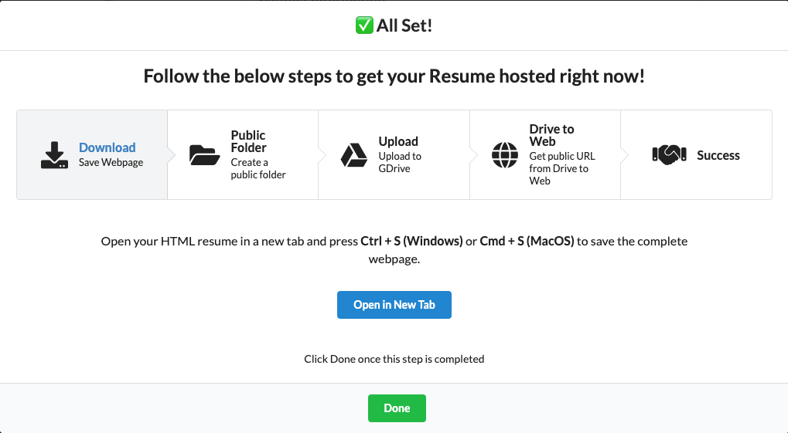

## Resume Builder (Next.js)

> Create, style and host your own HTML Resume onto the web simply by filling a form.

Sample: [Resume]('https://p2a2jxck6npi5gyzjti2fw.on.drv.tw/CV/Ayan%20Banerjee%20_%20Portfolio.html')
### Features

- [x] Sectional form to fill resume information
- [x] Progress bar to show progress of resume creation
- [x] Resume preview
- [x] Steps to download and host resume
- [ ] Automate HTML resume hosting
- [ ] Download resume as PDF
- [ ] Import and export resume

### Installation

Local installation:

```bash
    npm i or npm install
```

To run the project locally after installation execute `npm run dev`

### Pages

- **Home (Form to fill resume information)** [Path: /]
  - **`Sections`**
    - ==Bio==
      
    ---
    - ==Experience==
      
    ---
    - ==Skills==
      
    ---
    - ==Certifications==
      
    ---
    - ==Contact==
      
    ---
  - **`Error Handling`**
    
  ---
  - **`Submit`** (On click of ==Generate== button)
    
  ---
- **Preview (Previews resume with any sections filled)** [Path: /preview]
    You can preview your resume here till however much you have filled.

    Sample: [Preview]('https://p2a2jxck6npi5gyzjti2fw.on.drv.tw/CV/Ayan%20Banerjee%20_%20Portfolio.html')

    ---

- **Generate (Previews resume with all sections filled)** [Path: /generate]
    On confirming resume generation after successfully filling the form, user will be getting this popup to follow the steps.
    

    