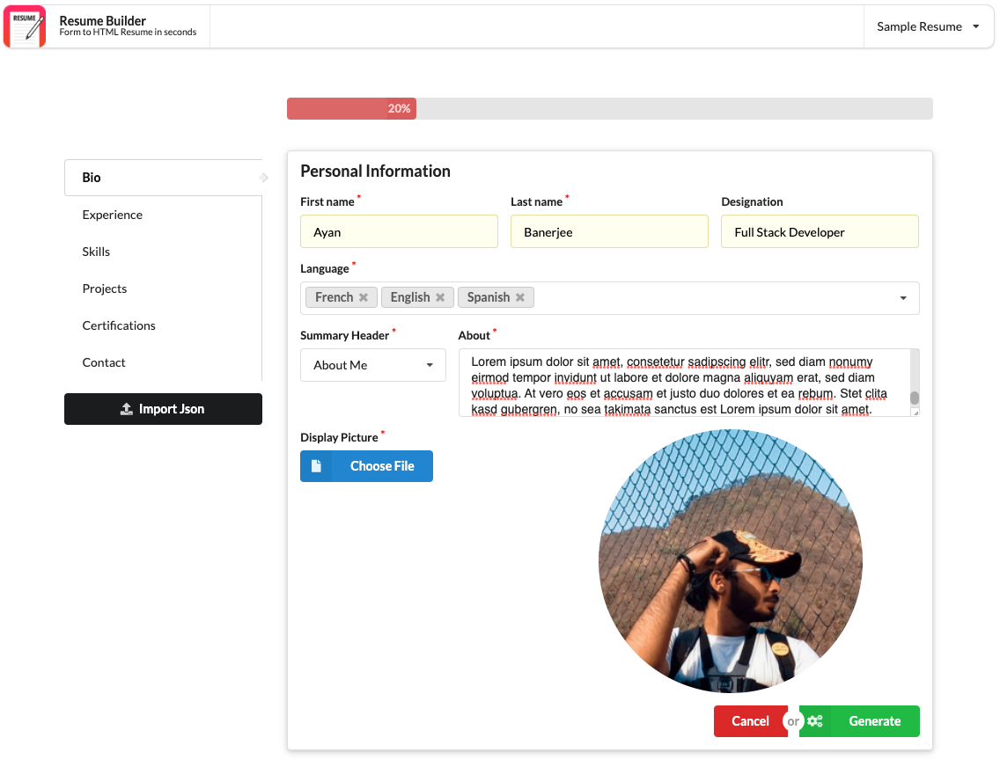

## Resume Builder (Next.js)
> Create, style and host your own HTML Resume onto the web simply by filling a form.

### Features

- [x] Sectional form to fill resume information
- [x] Progress bar to show progress of resume creation
- [x] Resume preview
- [x] Steps to download and host resume
- [ ] Automate HTML resume hosting
- [ ] Download resume as PDF
- [ ] Import and export resume

### Installation

Local installation:

```bash
    npm install
```

To run the project locally after installation execute `npm run dev`

### Pages

 - **Home (Form to fill resume information)** [Path: /] 
    - **`Sections`**
        - ==Bio==
        
        - ==Experience==
        
        - ==Skills==
        
        - ==Certifications==
        
        - ==Contact==
        
    - **`Error Handling`**
    
    - **`Submit`** (On click of ==Generate== button)
    
 - **Preview (Previews resume with any sections filled)** [Path: /preview] 
 - **Generate (Previews resume with all sections filled)** [Path: /generate] 
